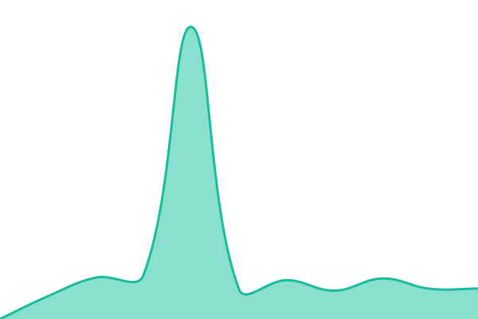
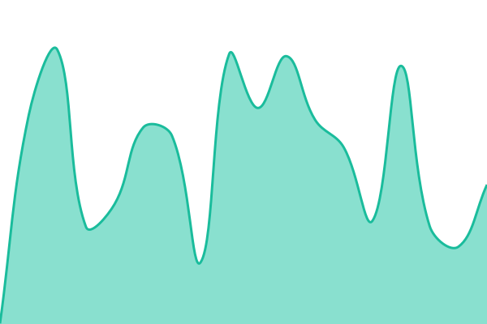
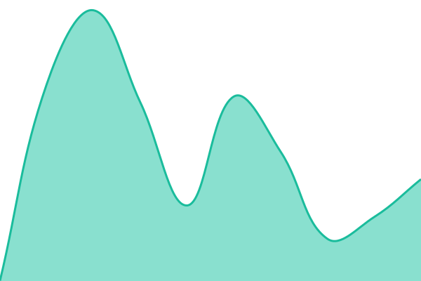
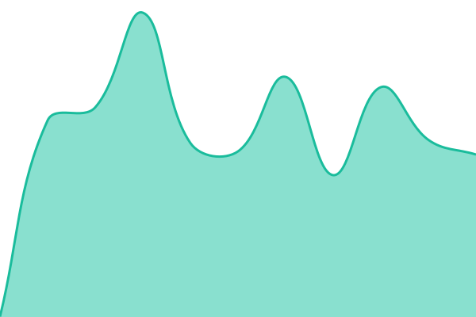

# [📈 Live Status](https://status.kotbo.fr): <!--live status--> **Tous les services sont opérationnels**

This repository contains the open-source uptime monitor and status page for [Kotbo-Bot](https://status.kotbo.fr), powered by [Upptime](https://github.com/upptime/upptime).

With [Upptime](https://upptime.js.org), you can get your own unlimited and free uptime monitor and status page, powered entirely by a GitHub repository. We use [Issues](https://github.com/Kotbo-Bot/kotbo-status/issues) as incident reports, [Actions](https://github.com/Kotbo-Bot/kotbo-status/actions) as uptime monitors, and [Pages](https://status.kotbo.fr) for the status page.

<!--start: status pages-->
<!-- This summary is generated by Upptime (https://github.com/upptime/upptime) -->
<!-- Do not edit this manually, your changes will be overwritten -->
<!-- prettier-ignore -->
| URL | Status | History | Response Time | Uptime |
| --- | ------ | ------- | ------------- | ------ |
|  [API Kotbo](https://api.kotbo.fr/health) | Opérationnel | [api-kotbo.yml](https://github.com/Kotbo-Bot/kotbo-status/commits/HEAD/history/api-kotbo.yml) | 

 464ms
     
 | 

<a href="https://status.kotbo.fr/history/api-kotbo">100.00%</a>
    

|  [Bot Discord](https://api.kotbo.fr/health/discord) | Opérationnel | [bot-discord.yml](https://github.com/Kotbo-Bot/kotbo-status/commits/HEAD/history/bot-discord.yml) | 

 352ms
     
 | 

<a href="https://status.kotbo.fr/history/bot-discord">100.00%</a>
    

|  [Base de données](https://api.kotbo.fr/health/db) | Opérationnel | [base-de-donnees.yml](https://github.com/Kotbo-Bot/kotbo-status/commits/HEAD/history/base-de-donnees.yml) | 

 321ms
     
 | 

<a href="https://status.kotbo.fr/history/base-de-donnees">100.00%</a>
    

|  [Redis](https://api.kotbo.fr/health/redis) | Opérationnel | [redis.yml](https://github.com/Kotbo-Bot/kotbo-status/commits/HEAD/history/redis.yml) | 

 274ms
     
 | 

<a href="https://status.kotbo.fr/history/redis">100.00%</a>
    

|  [Dashboard](https://dash.kotbo.fr) | Opérationnel | [dashboard.yml](https://github.com/Kotbo-Bot/kotbo-status/commits/HEAD/history/dashboard.yml) | 

 482ms
     
 | 

<a href="https://status.kotbo.fr/history/dashboard">100.00%</a>
    

<!--end: status pages-->

[**Visit our status website →**](https://status.kotbo.fr)

## 📄 License

- Powered by: [Upptime](https://github.com/upptime/upptime)
- Code: [MIT](./LICENSE) © [Anand Chowdhary](https://anandchowdhary.com)
- Data in the `./history` directory: [Open Database License](https://opendatacommons.org/licenses/odbl/1-0/)
